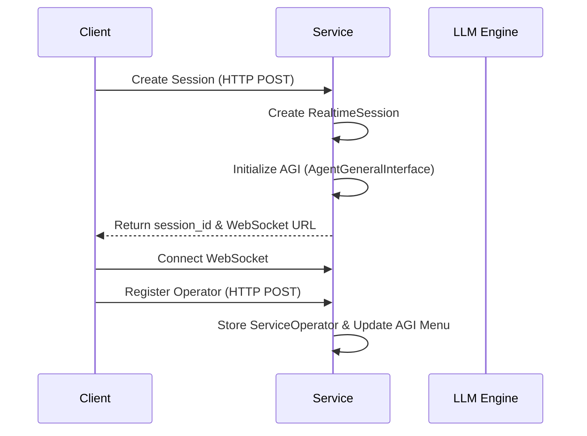
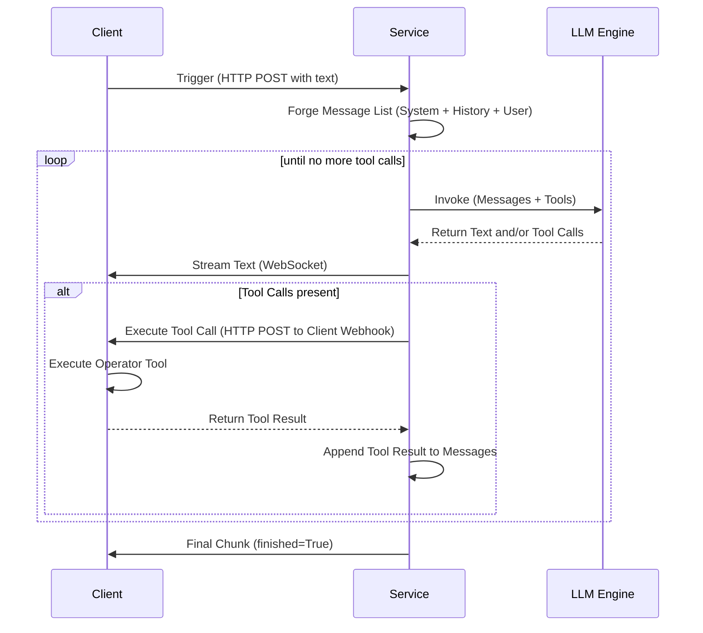

uv run -m dynamic_agent_service

# Operator
How to use the operator:
1. Define a class inheriting from `AgentOperator`.
2. Use `@agent_tool` to define methods that can be called by the agent.
3. (Optional) Use `@description` and `@flow` to provide high-level context and guidance to the agent about how to use the operator.
4. Register the operator instance using `await client.add_operator(operator_instance)`.

```python
from dynamic_agent_client import AgentOperator, agent_tool, description, flow

class MyOperator(AgentOperator):
    @description
    def get_description(self):
        return "Description for the agent"

    @flow
    def get_flow(self):
        return "1. step one\n2. step two"

    @agent_tool(description="Do something")
    def my_tool(self, arg1: str) -> str:
        return f"Done with {arg1}"
```

# Session Logic

## Start Up


## Trigger (includes operator usage)


# Logging
Rules for logging (implemented in `SessionLogger`):
- All logs are stored in the directory defined by `CACHE_DIR` environment variable.
- Logs are organized by session: `CACHE_DIR/session_log/{session_id}/`.
- Logs are stored in JSONL format with a `timestamp` field.
- **`setting.jsonl`**: Stores session configuration and initial settings.
- **`trigger_{n}.jsonl`**: Created for each trigger event, logging tools available, initial messages, LLM responses, tool calls, results, and compaction events.
- Writes are performed asynchronously using a background worker queue to avoid blocking main execution.
