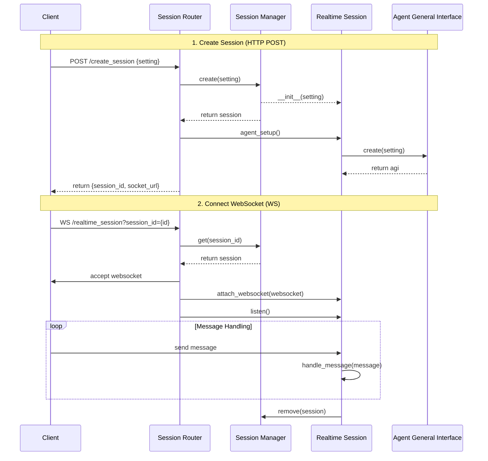

uv run -m dynamic_agent_service

### Session Start Logic

```mermaid
sequenceDiagram
    participant Client
    participant Router as Session Router
    participant Manager as Session Manager
    participant Session as Realtime Session
    participant AGI as Agent General Interface

    Note over Client, AGI: 1. Create Session (HTTP POST)
    Client->>Router: POST /create_session {setting}
    Router->>Manager: create(setting)
    Manager-->>Session: __init__(setting)
    Manager-->>Router: return session
    Router->>Session: agent_setup()
    Session->>AGI: create(setting)
    AGI-->>Session: return agi
    Router-->>Client: return {session_id, socket_url}

    Note over Client, AGI: 2. Connect WebSocket (WS)
    Client->>Router: WS /realtime_session?session_id={id}
    Router->>Manager: get(session_id)
    Manager-->>Router: return session
    Router->>Client: accept websocket
    Router->>Session: attach_websocket(websocket)
    Router->>Session: listen()
    loop Message Handling
        Client->>Session: send message
        Session->>Session: handle_message(message)
    end
    Session->>Manager: remove(session)
```